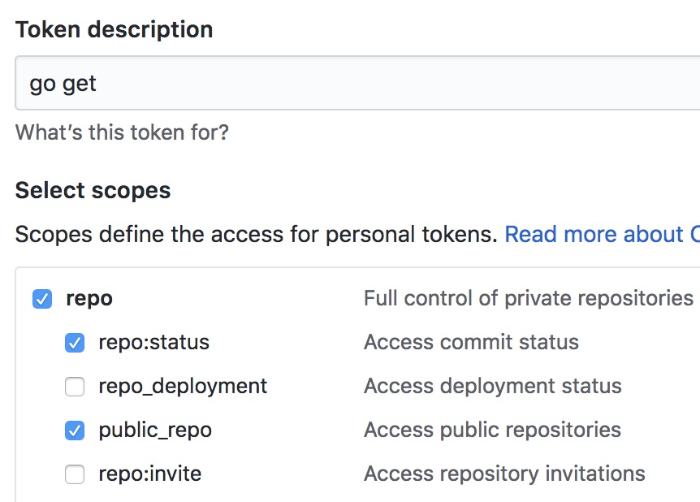
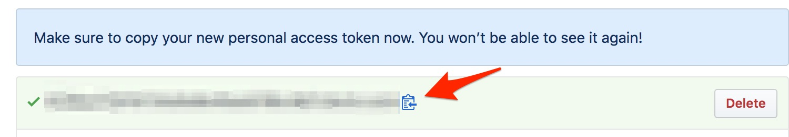

If you have two-factor-authentication set up on your Github account, you might run into password prompt error when you try to run `go get` on a private repo.

```shell
go get github.com/mycompany/my-private-project
# cd .; git clone https://github.com/mycompany/my-private-project /Users/jdoe/go/src/github.com/mycompany/my-private-project
Cloning into '/Users/jdoe/go/src/github.com/mycompany/my-private-project'...
fatal: could not read Username for 'https://github.com': terminal prompts disabled
package github.com/mycompany/my-private-project: exit status 128
```

This is because under-the-hood, go uses https to clone repos, and not ssh, so the go client can't access your ssh key.

Luckily, there is an easy fix.  Using a linux concept called a [netrc file](https://ec.haxx.se/usingcurl-netrc.html) you can instruct your computer to pass an authentication token over https to give you access to your private repo.

First, log into your Github account [visit this page](https://github.com/settings/tokens) to create a Personal Access Token.

Give it a name like `go get` and make sure it has both the public and private repo options selected.

It should look something like this:



Scroll to the bottom and click `Generate Token`.

You'll be presented with the token and a handy button to copy the token to your clipboard.  Click that:



Next, use your favorite editor to create a file called `~/.netrc` and give it the following contents, subtituting the `yourusername` value for your own gihub username, and `YOURTOKEN` for the token you just copied.

```bash
machine github.com
    login yourusername
    password YOURTOKEN
```

Now you should be able to `go get` your private repo without any problems!