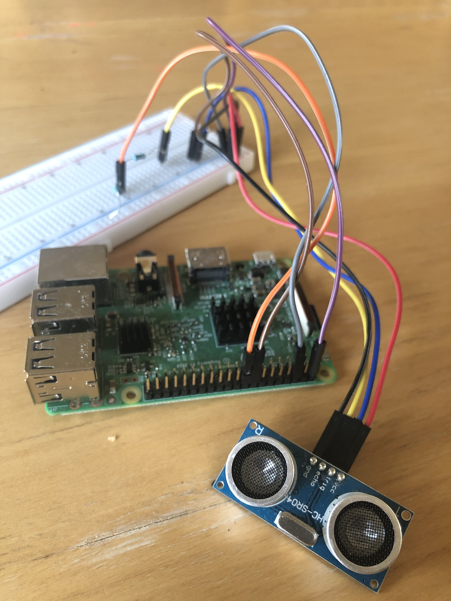

I started coding when I was about 10 years old, writing BASIC programs on an Apple IIc computer that my teacher somehow arranged for me to borrow over the summer.  Watching the computer faithfully execute my instructions, I felt all-powerful.  Once I had kids of my own, I couldn't wait for the day when I could help them learn to code, too.

# Whoa, what's that?

When the kids see code on the my screen, it rarely elicits questions or excitement.  They're just learning to read, and the jumble of words isn't all that interesting.  But when they see something like this it always makes them stop and ask "what's that?":

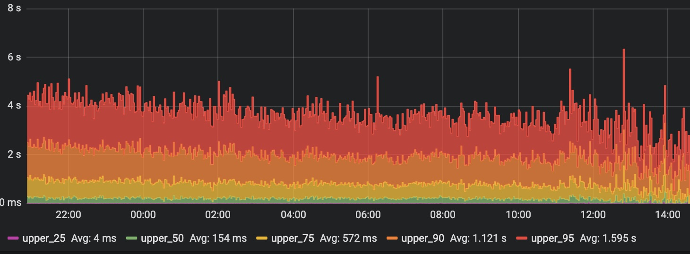

This is a graph produced by a software program called Grafana, which is commonly used for monitoring the health and behavior of complex systems.

I've always been drawn to graphs, too, and the idea that they make it easy to tell a "big picture" story in a small space.  In my current role as a Site Reliability Engineer, I very much enjoy producing graphs like this to help my team visualize our systems.  I wondered if there was a way I could teach Grafana to my kids in a way that would give them that same sense of excitement I got when I was a kid.

# A project is born

Getting kids excited about 95 percentile API response latency didn't seem that promising, so I thought about other things we could monitor and track metrics for.  One day, while the kids were jumping on our small indoor trampoline, I got an idea.  What if we could monitor the trampoline bounces, and graph the activity with Grafana?  The kids agreed this sounded like fun so we set off to make it happen.

So how should we build this?  I'd been hearing for a long time about how these great little $35 computers called Raspberry Pis could be wired up to all kinds of electronics and sensors.  Conveniently I already had a 4-node cluster of Raspberry Pis in the house, which I've been using to learn Kubernetes.  So far I'd only used it for running software, and I didn't know the faintest thing about controlling hardware, or wiring up circuits.

On came the imposter syndrome.

The Raspberry Pi forums are filled with hardcore electronics wizards.  I felt way out of my league.  But I stood tall, feigned total confidence, and posted on a forum for electronic sensor enthusiasts (yes, that's a thing).  I described our goal of instrumenting a trampoline to count jumps, and asked for some general strategic guidance.

I got several responses with some great ideas, but one stood out as being very simple, cheap, and sounded really cool: an ultrasonic rangefinder!  These are used to measure distance, specifically the distance between the sensor and whatever it's pointed at.  They are commonly used in robotics to detect what's around them.

Seemed like a promising idea, but there was no off-the-shelf solution for an ultrasonic sensor that could output to a Grafana-compatible database.  We'd have to put together a custom hardware and software solution to capture the sensor data using the Raspberry Pi.

# The Tiny Boombox

Now that I had successfully pretended to understand how an ultrasonic range finder works, I figured I'd better actually learn.  Fortunately I stumbled upon [an excellent tutorial](https://www.modmypi.com/blog/hc-sr04-ultrasonic-range-sensor-on-the-raspberry-pi) on what they do, how they work, and how to wire one up to a Raspberry Pi.

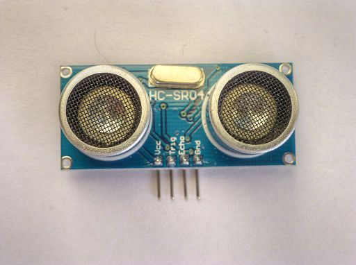
https://commons.wikimedia.org/wiki/File:HC_SR04_Ultrasonic_sensor_1480322_3_4_HDR_Enhancer.jpg

The tutorial is really great and I highly recommend it.  But if you're in a hurry, here's the gist.  An HC-SR04 sensor is basically a tiny boombox.  Those are actually two speakers that you see.  But instead of thumping out megabass on the low end of the spectrum, these bad boys do the opposite.  They emit ultrasonic sound -- too high pitched for our ears to pick up.  Like a radar system, it's used to send a "ping" (sound wave) out.  Next, it waits for the sound to bounce off of something and echo back to a receiver on the sensor.  Using software that we run on the Raspberry Pi, we control when the ping is sent, listen for the echo, and calculate the time difference between the two.  Once you have this timing information, you use some cool physics calculations about how fast sound moves through air to compute the distance to that object.  I thought that there must be a way to track changes on these numbers to infer trampoline jumps per-minute, and incentivize some good exercise.

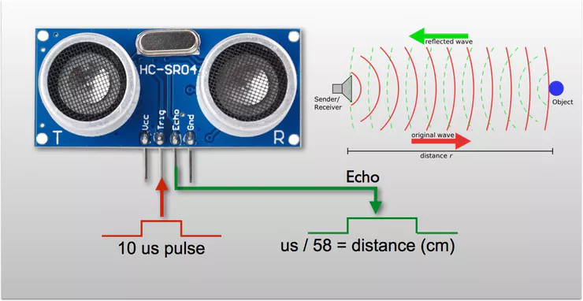

# Let's Build This

Now that I had a general design, it was time to assign some engineers to work on implementation.  My 4-year-old daughter and 6-year-old son were currently unassigned so I enlisted their help.  The task: connect the HC-SR04 sensor to the Raspberry Pi so that we could control it with software, and send the data to Grafana to graph.

Like many new projects related to computer software, It started off with an immediately-show-stopping problem.  The Raspberry Pi and the HC-SR04 sensor have _incompatible voltages_.  If you just hook a wire between the sensor and the Pi, you'll immediately fry the sensor.  This is because the sensor operates on merely 3.4 volts, and the Raspberry Pi outputs a sizzlin' 5 volts.  Fortunately, there was a workaround.  But it was going to involve us rolling up our sleeves, and going full-MacGyver with some wires and circuits.


We learned that a _resistor_ is a tiny tootsie-roll-shaped thing that takes in a higher amount of electricity on one side, and puts out a lower amount of electricity on the other side.  Using a couple of resistors, we could "step down" the voltage from the Pi to the sensor.  One option for wiring this up would be to use a soldering iron, and graft the proper resistors onto the wire.  But there was also an option that was less likely to result in an ER trip.

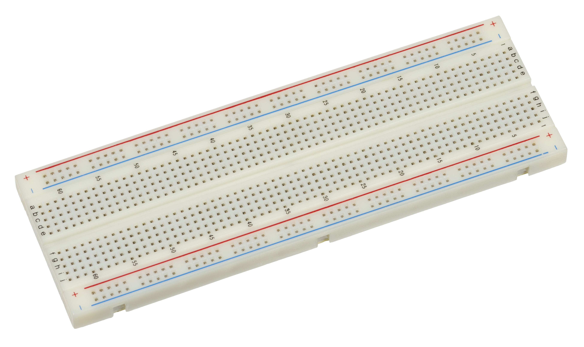
https://commons.wikimedia.org/wiki/File:Electronics-White-Breadboard.jpg

We learned about something new called a [breadboard](https://www.raspberrypi.org/magpi/breadboard-tutorial/) and were somewhat disappointed to learn that we didn't get to eat any bread.  We got over that fairly quickly, and learned that breadboards are small plastic rectangles with a bunch of holes in them.  You can push wires into the holes and it connects them with the other holes in convenient ways.  Breadboards are useful to us because they allow us to connect resistors to our sensor without using a soldering iron!

We followed [another great guide on how to wire up](https://www.modmypi.com/blog/hc-sr04-ultrasonic-range-sensor-on-the-raspberry-pi) the HC-SR04 to the Pi using a breadboard, resistors, and jumper wire.

Connecting jumper wires to the sensor             |  Using the breadboard to add resistors
:-------------------------:|:-------------------------:
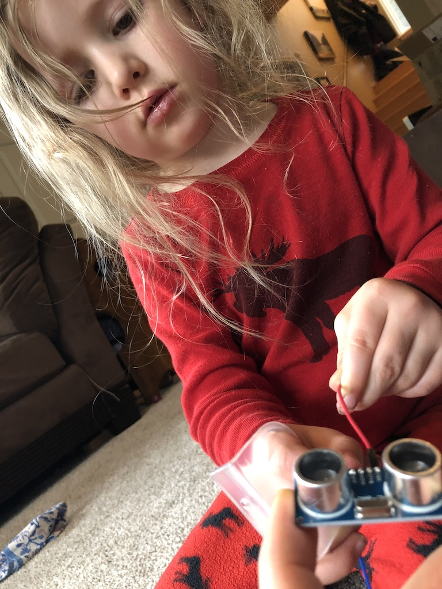  |  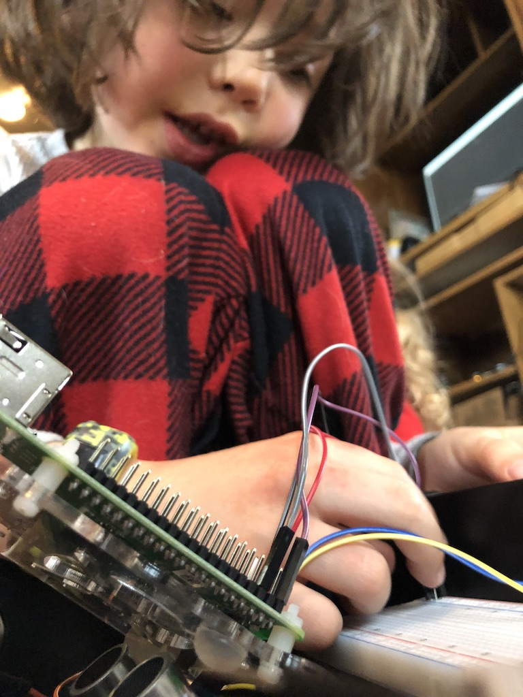

# Shopping List

1. Raspberry Pi 3B (or 3B+)
2. HC-SR04 Ultrasonic Sensor
3. Breadboard
4. Jumper wires
5. 1kΩ Resistor
6. 2kΩ Resistor

# Input, Processing, Output

https://open.spotify.com/track/56PeyadbUnz7wxQWa5xHeP

https://www.youtube.com/watch?v=z9ycsza7K2U

Let's break down what's connected to what here.  First, on the Raspberry Pi side, there are a series of pins called GPIO, which stands for *General Purpose Input & Output*.  These pins allow you to connect about a million different electronic devices to your Pi.  As the name implies, you can connect a jumper wire to an *input* to listen for signals from a device, process that input with software, and and connect to an *output* to send a signal to the device.

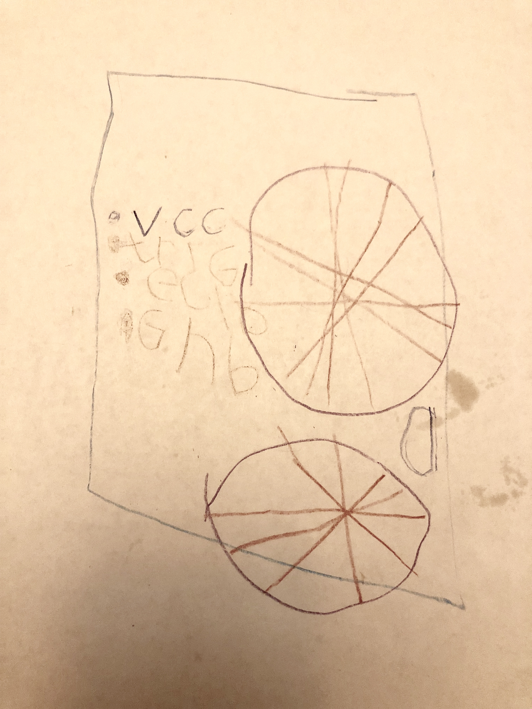
Wiring diagram showing the inputs and outputs for the sensor.

* vcc : Voltage at the common collector (power supply)
* trig: Data input that receives signal from the Pi requesting a measurement
* echo: Data output that sends back signal to the Pi when a ping is sent and again when the ping echo is received
* gnd: Ground wire (completes the circuit with vcc)

I'm primarily a NodeJS developer, and lucky for us, there is some great NodeJS support for both the Raspberry Pi's GPIO system and the HC-SR04 sensor.  [The full code can be found here](https://github.com/geekdave/trampoline), but we're also going to break it down line by line.

```nodejs
const Gpio = require('pigpio').Gpio;
```

First we import the pigpio library, which provides a nice NodeJS wrapper on top of the GPIO libraries which are written in C [citation needed].

Next, we register a trigger object on GPIO pin 23, which is wired up to... you guessed it... the `Trig` pin on the HC-SR04!

```
const trigger = new Gpio(23, { mode: Gpio.OUTPUT });
```

This allows us to send a signal to the sensor like so:

```
trigger.trigger(10, 1)
```

The trigger has two states, low (0) and high (1).  In the case of the HC-SR04, "high" means "I'm asking for a measurement!" and "low" means "relax - you're on break".

Next we register an echo object on port 24 which is connected to the similarly-named `Echo` pin on the HC-SR04:

```
const echo = new Gpio(24, { mode: Gpio.INPUT, alert: true });
```

This allows us to write code like this:

```
    echo.on('alert', (level, tick) => {
        if (level == 1) {
            startTick = tick;
        } else {
            const endTick = tick;
            const diff = (endTick >> 0) - (startTick >> 0); // Unsigned 32 bit arithmetic
            const distanceCM = diff / 2 / MICROSECONDS_PER_CM
```

Let's break down what's going on.  First we register an "event handler" using `echo.on`.  This means that whenever a signal is received from the HC-SR04, this function will get called.

The first time an event is received, it's the sensor sending a value of "1" (or "high" as we learned in the previous code example).  The meaning of the "high" signal is "hey, I just sent out the ping!"  When the sensor receives the ping bounced back to itself, it sends another signal but this time with a value of "0" or "low".  We can measure the time difference between when the first and second signal were received to figure out how much time it took the signal to bounce from the sensor to its target and back.

We then divide this roundtrip time by 2 to get the one-way time, and then divide again by a magical constant that tells us how quickly sound moves through the air (assuming a certain temperature -- does altitude also make a difference?)

Now if we put the sensor under the trampoline...

[console output of measurements]

We see on the console that first the program computes the baseline trampoline height by taking 3 successive measurements and averaging them together.  After that, we are getting a new measurement every 50 milliseconds.  We send these values to InfluxDB to store them over time.  Then we can plot them with Grafana!

I asked my son what he thought the graph would look like.  He said "a sawtooth!" referring to a graph of a production system he had seen on my screen a few weeks prior.  We pulled up the graph, saw a mostly flat line.  Then he started jumping...

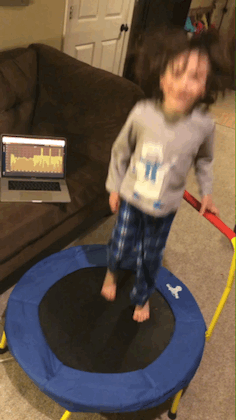

Here we see the baseline 18 cm (plus or minus a few millimeters) and then when he started jumping we saw..... _a sawtooth!_  We were both super excited that his hypothesis proved true.

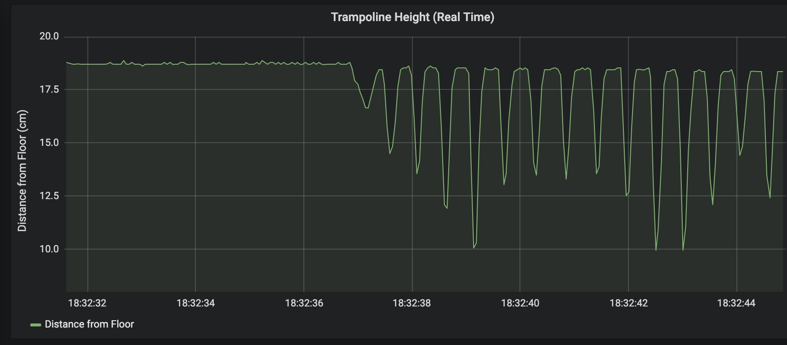

* [Write about how to infer discrete jumps using thresholds and sampling.  Costco samples!!!]

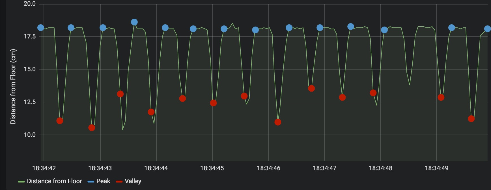

A mostly uninterrupted 15 min streak:

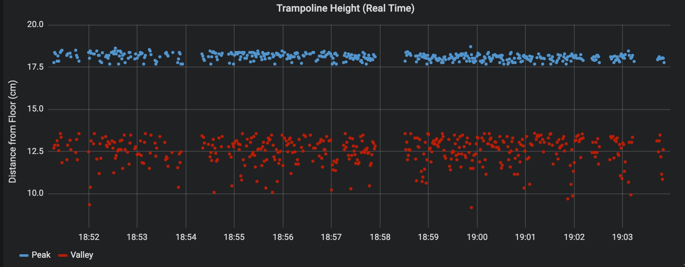

Adding a high score to keep track of highest jumps per minute this session.  Pump up the bar on the right!

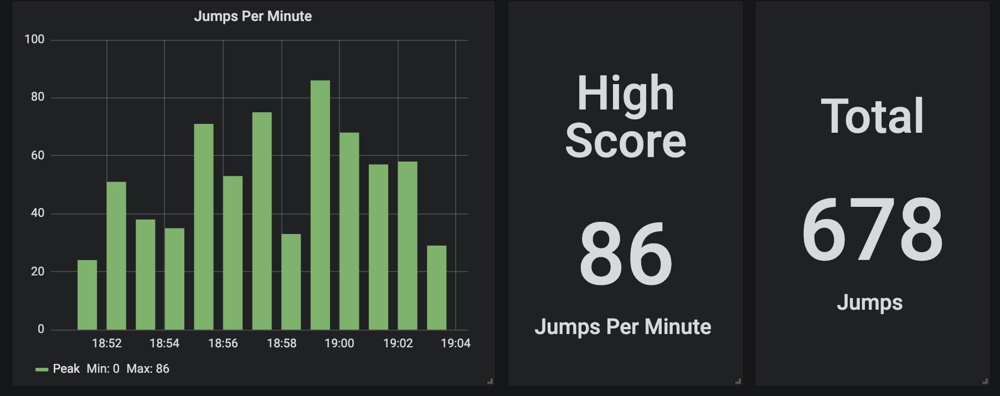


* measuring distance with science (figure out elevation question)