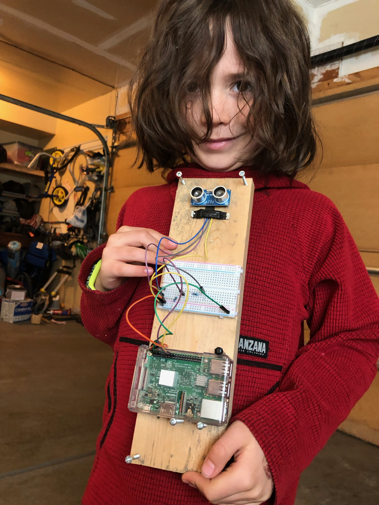
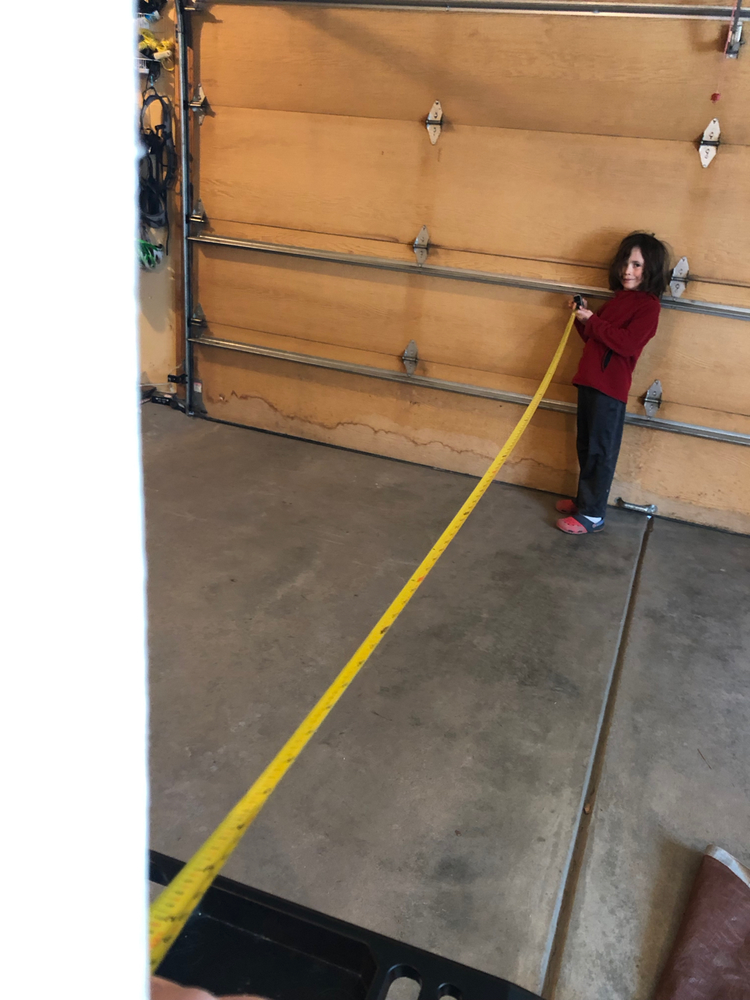
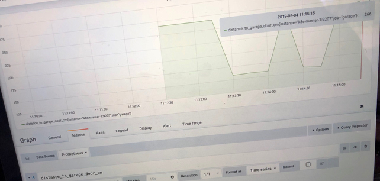
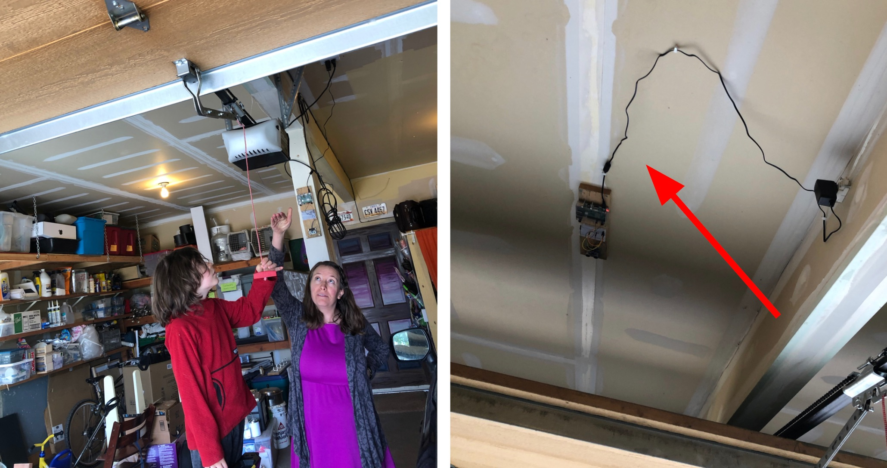
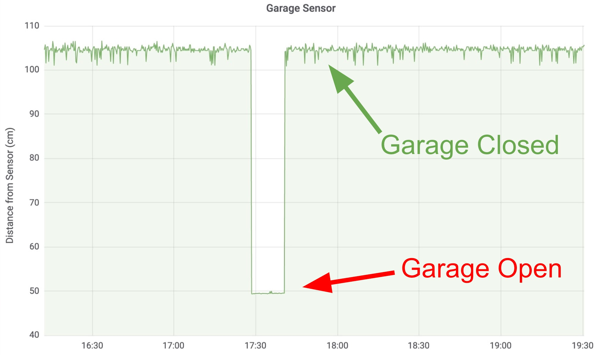

# Note

This is an adaptation of a conference talk I presented with my kids at Monitorama in Portland in 2019. Read-on for the backstory (it's a good story!) or skip straight to [how to build a garage door sensor]().

# The Bear Trap

We recently started reading the _Little House on the Prairie_ series with the kids. We're hearing Laura Ingalls Wilder's account of growing up in rural Wisconsin in 1865 (???). One element of the story that established itself early-on as a recurring theme was the notion of the parents teaching the children about all of the tools they use. The children learned how to churn butter, how to load a rifle, and how to maintain a bear trap. The girls learned how to dip a feather in grease and lubricate the trap to keep it maintained.


The parents found ways to involve the children in at least some small task related to the job at hand. And the children gradually built an understanding of how these tools worked, and the value they provided to the family.

Thanksfully mosf of us don't have to trap bears anymore. But we live in Colorado and we share the mountains with bears. When bears are hungry they can smell food miles away. One time, my wife's grandmother who lives in the mountains had an incident where a bear tore off her screen door, opened the fridge, and ate everything inside _except the weight watchers._


We have a pretty solid front door on our house, so we're not too worried about bears literally tearing down the door. But we keep our trash cans in the garage and we sometimes forget to close the garage door when we're coming inside. Bears in our neighborhood have been known to help themselves to exposed trash cans, leaving behind a huge mess.

I thought to myself, _if only there were a way to **monitor** the garage door, and somehow **alert** me when we forgot to close it…_

Hmm… Hmmmmmm… Aha! Prometheus! At work, Prometheus is one of my tools-of-the-trade. And much like a bear trap, people are often afraid to touch it! Let's face it, Prometheus can be intimidating for newcomers. Its query language is powerful, but hard to comprehend. The documentation intentionally eschews walk-throughs and examples in favor of acting as a terse reference manual. There's a fantastic book by Brian Brazil, the founder of Prometheus, but it's a big time commitment. I wondered if I understood Prometheus well enough to teach it to my 6 and 4-year old kids. If I could teach them the basics, then perhaps I could have some success teaching the basics at work to a bunch of grown-ups!

# Building on GrafanaCon

We had just returned from GrafanaCon, where the kids co-presented their first conference talk with me. The kids had learned the Grafana graphing software to graph the movement of a trampoline as they jumped on it. They learned about using an ultrasonic sensor to measure the distance between the floor and the trampoline. And they learned about graphing how that measurement changes over time with Grafana.  We hooked up the sensor to a tiny credit-card sized computer called a Raspberry Pi using a tool called a breadboard for connecting wires and pins together.

We talked about how we could use the same tools for a different purpose — measuring the distance from a place inside the garage, looking outward, to tell if the door was open or closed.  We wired up the sensor using these instructions and set out to find the optimal place in the garage to put it.



First we attempted to place the sensor on a post in the middle of the garage.  We measured the distance from the post to the garage door, with the expectation that our sensor would give us a similar measurement.  



Our initial attempt yielded highly inconsistent results.  We had expected to see a result of around 266cm with the door closed, based on the tape measure results.  But when we graphed the measurement over time, we saw major peaks and valleys, with the high points in the expected range, but several mysterious low points that seemed to happen randomly.



We realized from reading the documentation that the ultrasonic sensor becomes less accurate the greater the distance it's measuring.  As the distance increases, the sound waves spread out more, and are more likely to reflect off of things that are not directly in front of it.  In this case, the sensor was catching occasional reflections from the ceiling or one of the cars parked in our garage.  

# Back to the Drawing Board

We knew that if we could get the sensor closer to the garage door, we had a shot at getting more accurate measurements.  But there wasn't a great place to put it facing the garage door where it wouldn't get in the way of the cars or the garage door tracks themselves.  We were stuck scratching our heads, so we invited my wife Jerica to come out and see the situation.  She came up with a totally different idea: _What if we put the sensor on the ceiling, facing downwards?_ Then when the garage door was open, and rolled up onto the ceiling, it would be directly in front of the sensor, and hopefully a nice predictable distance.



The new solution worked perfectly and soon we had a nice predictable graph.  When the garage door was open and the door was rolled up close to the sensor on the ceiling, the distance was consistently just under 50cm.  When the garage door was closed, and the door was no longer in front of the sensor, the sensor was measuring the distance to the roof of my car (around 105cm) or to the floor (around 250cm ???) if my car was not in the garage.

The graph looked like this now:



We now had measurements that were predictable enough to use for an alert!

# A Reflection Point

This was a great opportunity to have a conversation with Boden about the importance of diversity in teams.  We talked about how when Jerica joined our team, she contributed a new viewpoint that we didn't have before, and that new perspective allowed us to overcome a roadblock.  We talked about how diversity works across many dimentions, such as gender, race, nationality, and sexual orientation, and that lack of diversity in tech is a problem that we all need to help fix.  Having more diverse teams helps everyone feel welcome, and helps teams solve problems more effectively.  <Links to research?>

# Gotta Draw The Line Somewhere

Our next step was to set a _threshold_ for our alert.  Prometheus allows us to continuously monitor a metric and send an alert if the value of that metric goes out of bounds.  To determine what that threshold should be, we zoomed in on the area of the graph for when the garage was open.  It looked like this:

< picture of zoomed in graph >

Some fluctuation in the sensor's measurement appears to be normal, but the amount of fluctaution is smaller when the sensor is close to its target.  We noticed that with the garage door closed, the distance was consistently below 50cm.  So we picked 50 as our alert criteria, and it was time to teach the kids how to craft their first Prometheus alert!

```
alert: GarageDoorOpen
expr: distance_to_garage_door_cm < 50
for: 10m
```

Let's take a closer look at each part of this alert.  The first `alert` part is just a friendly name to tell one alert apart from another.  

The second part `expr` does two things: first, it tells Prometheus to periodically check what the value of `distance_to_garage_door_cm` is.   By default, Prometheus will check this every 15 seconds.   Then, the `< 50` part tells Prometheus how to tell if we've reached an alert condition.  

The `for:` section is optional, but it's important for our needs.  Without it, we'd get alerted as soon as the garage door opened.  But we didn't want this, because having the garage door open for short periods of time is part of everyday life.  By including `for: 10m`, we tell Prometheus to only send an alert if the condition in the `expr:` section holds true for 10 minutes.  The kids agreed that 10 minutes should be plenty of time to get out of the car and bring their stuff in. 

# Urgent vs. Important

There are many ways that we can be alerted about things: the buzzing of an alarm clock, ringing of a phone, or beeping of a pager can wake us from sleep for things that are urgent and can't wait.  On the other hand, a light on our car's dashboard, or an email in our inbox might let us know about something that's important but doesn't require us to drop everything.  We talked about this with the kids — that some things are important but not urgent.  And that we can design our alerts to take this into account.  

For example, did we need a loud sound to play if the garage door is open?  Was it so urgent that we should interrupt our dinner?  Ideally we wanted something that we would eventually notice, but wouldn't be disruptive to life at home.

We recently had installed a few Phillips Hue color changing light bulbs in our living room to set some ambiance during movie night.  We agreed that changing the color of the lights to something noticeable like red would be a great way to alert us if we forgot to close the garage door.

I had read that in addition to using the app on my phone to control the color of the lights that there was also an API to control them programmatically.  But how could we connect the dots between the light bulbs and Prometheus?  Luckily, there is a great software program called Node-Red which is designed exactly for connecting things together in an "if this, then that" kind of way.  And there was a plugin for Node-Red called Hue Magic, which controls Philips Hue light bulbs!

 