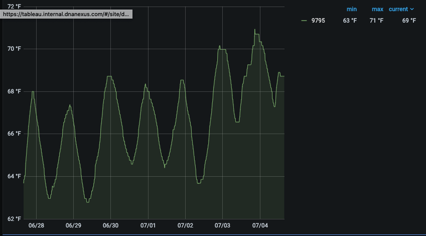

---
title:
  Graphing Temperature and Humidity with Grafana, Raspberry Pi, and Radio Waves
date: '2019-01-04'
layout: post
draft: false
path: '/posts/temperature-sensors-grafana/'
category: 'Tips'
tags:
  - 'Teaching'
  - 'Kids'
  - 'RaspberryPi'
description:
  'Graphing Temperature and Humidity with Grafana, Raspberry Pi, and Radio Waves!'
---

# Building a temperature and humidity monitoring dashboard with Grafana

# Pre-Requisites

This guide assumes basic familiarity with the Linux operating system and Raspberry Pi computers.

# Shopping List

1. AcuRite Wireless Indoor Outdoor Temperature and Humidity Sensor (06002M) $12.99
   Sensor model: 592TXR / 06002
   https://www.amazon.com/AcuRite-06002M-Wireless-Temperature-Humidity/dp/B00T0K8NXC

You can start with one, and expand to as many sensors as you want. We have a few scattered around the house, one outside, one in the fridge and one in the freezer.

2. RTL-SDR Radio & Antenna Kit $34.95 + 1.99 shipping
   https://www.amazon.com/RTL-SDR-Blog-RTL2832U-Software-Defined/dp/B011HVUEME

This is a radio receiver that will decode the signals sent from the temperature sensors. You can also decode all sorts of other radio signals with it.

3. Raspberry pi
   https://www.amazon.com/Vilros-Raspberry-Pi-transparente-refrigerada/dp/B07TKFFCF1

You could plug the radio receiver into a desktop or laptop computer, but you'd have to keep it running all the time. The Raspberry Pi is an affordable, low-power computer that you can leave running all the time.

4. (Optional) RTL-SDR Book
   https://www.amazon.com/gp/product/1514716690

If you'd like to learn more about "Software Defined Radio", or the process of decoding radio signals with computer programs, this book is really fun. You can learn how to receive things like aircraft flight signals, and weather satellite transmissions.

# Install InfluxDB

To record the measurements of your sensors over time, you'll need to store their measurements in a database. I recommend using InfluxDB, a free and open source timeseries database that performs well on low-resource environments such as the Raspberry Pi.

Here's a great guide to installing:
https://pimylifeup.com/raspberry-pi-influxdb/

# Create a database

```
pi@pi2:~ $ influx
Connected to http://localhost:8086 version 1.8.0
InfluxDB shell version: 1.8.0
> create database weather
```

Press CTRL-D to exit.

# Install rtl_433

This will take a long time.  I recommend watching a movie while you do this part. :) 

```
apt-get update
apt-get install -y git libtool libusb-1.0.0-dev librtlsdr-dev rtl-sdr cmake automake python3 python3-pip
git clone https://github.com/merbanan/rtl_433.git
cd rtl_433
./build.sh
```

# Run the program

Test it out using:

```
./rtl_433 -C customary -R 40
```

# Turn on the sensors

One-at-a-time, install batteries in your sensors.  You should see some output in the console after a few seconds.  Make note of the sensor ID and verify that the temperature looks right.  You may also pick up sensors from your neighbors, so be sure you've got the right ones.

# Redirect output to InfluxDB

Run this command to send output to the database instead of the console.  Substitute localhost for whatever host is running InfluxDB if it's not localhost.

```
/usr/local/bin/rtl_433 -C customary -R 40 -F influx://localhost:8086/write?db=weather
```

40 is the configuration for the Acurite sensor.  See the rtl_433 readme for all the options of things you can monitor:

```
    [40]  Acurite 592TXR Temp/Humidity, 5n1 Weather Station, 6045 Lightning
```

# Install Grafana

https://pimylifeup.com/raspberry-pi-grafana/

After install, log in and go to Settings > Datasources.

Add a new datasource http://localhost:8086 (or substitute the hostname running InfluxDB).  And set the database name to "weather".  Name the datasource "InfluxDB"

# Create a dashboard

Create a new dashboard, select InfluxDB as the datasource.  And add the following query, but change your id to match the sensor ID you observed earlier.


You should now see a graph like this!


